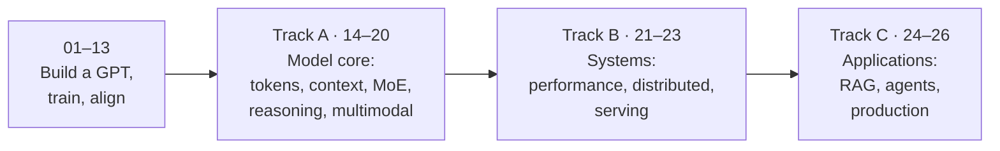
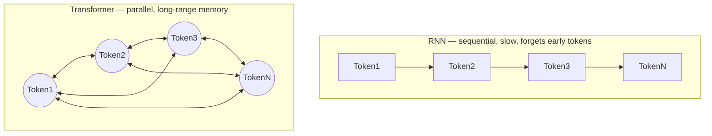

# Transformer Learning Journey

A hands-on guide from *"what is attention?"* to *"I can build, train, serve, and ship an LLM
system."* Start by building a GPT from scratch; end with distributed training, production serving,
RAG, and agents — every concept implemented from primitives and verified by running it.

## What You'll Learn

**Build a GPT (01–13)**
1. **Historical Evolution**: Why Transformers replaced RNNs
2. **Core Components**: Embeddings, Attention, Multi-Head Attention
3. **Architecture**: How pieces fit together in a Transformer block
4. **Practical Application**: Train your own text generator
5. **Training Deep Dive**: Loss & perplexity, train/val splits, LR schedules, mixed precision
6. **Inference & Decoding**: Greedy/top-k/top-p/beam search, repetition penalty, the KV cache
7. **Architecture Families**: Encoder-only (BERT) and encoder-decoder (seq2seq)
8. **Modern LLMs**: RMSNorm, RoPE, SwiGLU, Grouped-Query Attention, FlashAttention
9. **Post-Training & Alignment**: Instruction tuning (SFT), LoRA, reward models, RLHF & DPO

**Track A · Model core (14–20)** — the frontier knowledge the 2017 paper lacked
10. **Tokenization**: byte-level BPE from scratch, and what it breaks
11. **Long context**: why models break past their training length; RoPE scaling (PI/NTK/YaRN), ALiBi, attention sinks
12. **Attention variants**: MLA, linear attention, state-space models (Mamba), hybrids
13. **Mixture-of-Experts**: routing, load balancing, and the loss-free scheme
14. **Reasoning & test-time compute**: Chain of Thought, verifiers, RLVR, GRPO from scratch
15. **Efficiency**: quantization (GPTQ/AWQ/SmoothQuant), distillation, pruning
16. **Multimodal**: ViT, CLIP, and vision-language models

**Track B · Systems (21–23)** — training and serving at scale
17. **Performance first principles**: the roofline, and why prefill and decode are different problems
18. **Distributed training**: data/tensor/pipeline/expert parallelism, ZeRO/FSDP — with a real multi-process run
19. **Inference serving**: PagedAttention, continuous batching, speculative decoding, all from scratch

**Track C · Applications (24–26)** — building products
20. **RAG**: chunking, BM25, dense retrieval, hybrid fusion, reranking, evaluation
21. **Agents**: tool use, ReAct, memory, context engineering, prompt-injection defense
22. **Production**: SLOs, multi-tenant LoRA serving, evaluation, safety, cost engineering

## Project Structure

```
transformer-playground/
├── notebooks/                    # Interactive learning (start here!)
│   ├── 01_evolution.ipynb … 07_text_generation.ipynb   # Build a GPT from scratch
│   ├── 08_training.ipynb … 11_modern_architectures.ipynb  # Training, inference, families, modern stack
│   ├── 12_instruction_tuning_and_lora.ipynb, 13_preference_alignment.ipynb  # Post-training
│   │   ── Track A · Model core ────────────────────────
│   ├── 14_tokenization.ipynb            # Byte-level BPE from scratch
│   ├── 15_long_context.ipynb            # RoPE scaling, ALiBi, attention sinks
│   ├── 16_attention_variants.ipynb      # MLA, linear attention, Mamba, hybrids
│   ├── 17_mixture_of_experts.ipynb      # Routing, load balancing, loss-free
│   ├── 18_reasoning_and_test_time.ipynb # CoT, verifiers, RLVR, GRPO
│   ├── 19_efficiency.ipynb              # Quantization, distillation, pruning
│   ├── 20_multimodal.ipynb              # ViT, CLIP, vision-language models
│   │   ── Track B · Systems ───────────────────────────
│   ├── 21_performance_first_principles.ipynb  # Roofline, prefill vs decode
│   ├── 22_distributed_training.ipynb    # DP/TP/PP/EP, ZeRO/FSDP (+ real run)
│   ├── 23_inference_serving.ipynb       # PagedAttention, batching, speculation
│   │   ── Track C · Applications ──────────────────────
│   ├── 24_rag.ipynb                     # Retrieval-augmented generation
│   ├── 25_agents.ipynb                  # Tool use, ReAct, context engineering
│   └── 26_production.ipynb              # SLOs, serving, evaluation, safety, cost
├── docs/                        # 📚 Study aids (reference material)
│   ├── roadmap.md               # The whole arc + paths by role
│   ├── study-guide.md           # Objectives & self-check questions per notebook
│   ├── glossary.md              # Every key term in one line
│   ├── cheatsheet.md            # Formulas, tensor shapes, quick reference
│   ├── architecture.md          # Systems reference: parallelism, serving, cost
│   ├── variants-atlas.md        # Transformers beyond text (vision, science, RL…)
│   ├── references.md            # Authoritative papers, courses & videos
│   ├── references-zh.md         # 中文学习资料 (Chinese-language resources)
│   ├── diagrams.md              # 📊 Mermaid flowcharts + generated figures
│   └── images/                  # Generated PNGs (+ generate.py)
├── src/                         # PyTorch implementation
│   ├── embeddings.py            # Embedding layers (+ position offset for KV cache)
│   ├── attention.py             # Attention mechanisms (+ cached path)
│   ├── transformer.py           # Transformer blocks (+ cached path)
│   ├── gpt.py                   # 2017-style GPT, with KV-cache generation
│   ├── modern.py                # LLaMA-era stack: RMSNorm, RoPE, SwiGLU, GQA, ModernGPT
│   ├── moe.py                   # Mixture-of-Experts: router + MoEFeedForward
│   ├── lora.py                  # LoRA, merging, multi-adapter serving
│   └── train.py                 # Training utilities
├── tests/                       # pytest: shapes, causality, RoPE, KV cache, LoRA, MoE
├── requirements.txt             # Core deps (CPU, runs all of Track A)
├── requirements-advanced.txt    # Optional deps for some Track B/C cells
└── data/                        # Training data
    └── sample_text.txt          # Shakespeare sample
```

## 📚 Study Aids

Alongside the notebooks, the [`docs/`](docs/) folder has supplementary reference material:

- [**Roadmap**](docs/roadmap.md) — the whole arc across all three tracks, a dependency graph, and recommended paths by role (research / training / inference / applications).
- [**Study Guide**](docs/study-guide.md) — prerequisites, the learning arc, per-notebook objectives, and self-check questions.
- [**Glossary**](docs/glossary.md) — one-line definitions for every key term, mapped to the notebook that teaches it.
- [**Cheat Sheet**](docs/cheatsheet.md) — formulas, tensor shapes, decoding params, and the 2017→modern component map.
- [**Architecture**](docs/architecture.md) — systems reference: parallelism selection, serving decisions, memory and cost formulas.
- [**Variants Atlas**](docs/variants-atlas.md) — Transformers beyond text: vision, speech, science, decision-making, code.
- [**References**](docs/references.md) — authoritative papers, blogs, courses, and videos, organized by topic.
- [**References (中文)**](docs/references-zh.md) — 中文学习资料：李沐论文精读、李宏毅课程、动手学深度学习、苏剑林博客、Datawhale 教程等。
- [**Diagrams**](docs/diagrams.md) — visual companion: Mermaid flowcharts for every stage plus generated figures.

## Getting Started

### 1. Install Dependencies

```bash
pip install -r requirements.txt
```

All of notebooks 01–20 (the trunk and Track A) run on a CPU with only these. Some Track B/C cells
use optional libraries — install `requirements-advanced.txt` for those, or skip them: every such
cell degrades gracefully and prints its expected output when the library is absent.

```bash
pip install -r requirements-advanced.txt    # optional, for some NB 22–26 cells
pytest tests/                                # verify the src/ implementations
```

### 2. Start Learning

Open the notebooks in order:

```bash
jupyter notebook notebooks/
```

Or use VS Code / Cursor with the Jupyter extension.

### 3. Train Your Model

After going through the notebooks, train your own text generator:

```python
from src.train import train_gpt, generate_text

# train_gpt returns the trained model, the fitted tokenizer, and the
# per-epoch train/val loss history
model, tokenizer, history = train_gpt('data/sample_text.txt', epochs=50)

# generate_text handles encoding the prompt and decoding the output
print(generate_text(model, tokenizer, "To be or not to be", max_tokens=100))
```

Or run it straight from the command line:

```bash
python -m src.train data/sample_text.txt
```

## Learning Path

| Notebook | Topic | Time | Key Concept |
|----------|-------|------|-------------|
| 01 | Evolution | 30 min | Why Transformers exist |
| 02 | Embeddings | 30 min | Converting text to numbers |
| 03 | Attention | 45 min | The core innovation |
| 04 | Multi-Head | 30 min | Parallel attention |
| 05 | Blocks | 30 min | Assembling components |
| 06 | Architecture | 30 min | Full picture |
| 07 | Generation | 60 min | Hands-on training |
| 08 | Training | 60 min | Loss, perplexity, LR schedules, fine-tuning |
| 09 | Inference | 60 min | Decoding strategies & KV cache |
| 10 | Encoders & Seq2Seq | 45 min | BERT & encoder-decoder |
| 11 | Modern Architectures | 45 min | RMSNorm, RoPE, SwiGLU, GQA, FlashAttention |
| 12 | Instruction Tuning & LoRA | 60 min | Base model → assistant (SFT, loss masking, LoRA) |
| 13 | Preference Alignment | 60 min | Reward models, RLHF & DPO |
| **14** | **Tokenization** | 60 min | Byte-level BPE; why models miscount letters |
| **15** | **Long Context** | 60 min | RoPE scaling, ALiBi, attention sinks, KV cache |
| **16** | **Attention Variants** | 75 min | MLA, linear attention, Mamba, hybrids |
| **17** | **Mixture-of-Experts** | 60 min | Routing, load balancing, loss-free scheme |
| **18** | **Reasoning & Test-Time** | 75 min | CoT, verifiers, RLVR, GRPO from scratch |
| **19** | **Efficiency** | 60 min | Quantization, distillation, pruning |
| **20** | **Multimodal** | 60 min | ViT, CLIP, vision-language models |
| **21** | **Performance** | 60 min | Roofline; prefill vs decode |
| **22** | **Distributed Training** | 75 min | DP/TP/PP/EP, ZeRO/FSDP (+ real run) |
| **23** | **Inference Serving** | 75 min | PagedAttention, batching, speculation |
| **24** | **RAG** | 60 min | Chunking, BM25, hybrid, reranking, eval |
| **25** | **Agents** | 60 min | Tool use, ReAct, context engineering, safety |
| **26** | **Production** | 60 min | SLOs, serving, evaluation, safety, cost |

**Total: ~24 hours for thorough understanding** (trunk ~9–10 h, then ~14 h across the tracks)

Notebooks **01–13** build a GPT and take it through post-training alignment — the trunk. Three
tracks then extend it: **A (14–20)** the frontier model core, **B (21–23)** training and serving
at scale, **C (24–26)** building applications. See [**docs/roadmap.md**](docs/roadmap.md) for the
dependency graph and paths by role.

## The Learning Journey at a Glance



See [**docs/roadmap.md**](docs/roadmap.md) for the full picture and
[**docs/diagrams.md**](docs/diagrams.md) for a flowchart of every stage.

## The Key Insight

Traditional sequence models (RNNs) process tokens one at a time; Transformers let every
token look at every other token simultaneously — that's **Self-Attention**, the mechanism
you'll implement from scratch.



## Requirements

- Python 3.8+
- NumPy, PyTorch, Matplotlib/Seaborn, Jupyter, tqdm (all in `requirements.txt`)
- Optional for a handful of Track B/C cells: `transformers`, `datasets`, `faiss-cpu`,
  `sentence-transformers`, `tiktoken`, `pytest` (`requirements-advanced.txt`)

Everything runs on a CPU. Track A notebooks execute in a few minutes each; Track B is mostly
analytical and runs in seconds.

## Key References

The full, per-topic list is in [**docs/references.md**](docs/references.md). A few anchors:

- [Attention Is All You Need](https://arxiv.org/abs/1706.03762) — the Transformer
- [LLaMA](https://arxiv.org/abs/2302.13971) — the modern decoder-only stack (NB 11, 16)
- [DeepSeek-V3](https://arxiv.org/abs/2412.19437) — MLA, MoE, loss-free balancing (NB 16, 17)
- [DeepSeek-R1](https://arxiv.org/abs/2501.12948) — RLVR and GRPO (NB 18)
- [Efficiently Scaling Transformer Inference](https://arxiv.org/abs/2211.05102) — the systems foundation (NB 21)
- [PagedAttention / vLLM](https://arxiv.org/abs/2309.06180) — modern serving (NB 23)
- [Building Effective Agents](https://www.anthropic.com/research/building-effective-agents) — workflows vs agents (NB 25)
- [nanoGPT](https://github.com/karpathy/nanoGPT) — the spiritual companion to the trunk

Happy learning! 🚀

