# 图解与流水线 (Diagrams & Pipelines)

A visual companion to the notebooks. The **Mermaid** diagrams render automatically on
GitHub; the **PNG** figures (in [`images/`](images/)) are generated from real math by
[`images/generate.py`](images/generate.py) — re-run `python3 docs/images/generate.py` to rebuild them.

> 中文说明穿插在每节里。流程图说明「数据怎么流」，PNG 展示「真实的数值长什么样」。

---

## 0. 学习路径总览 (The whole journey)

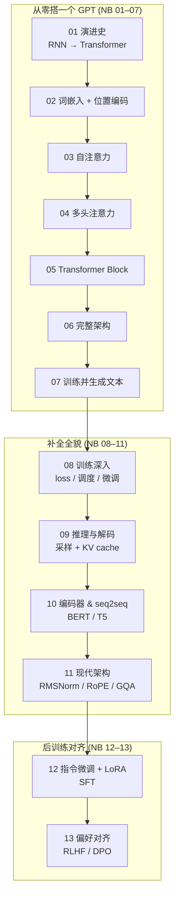

---

## 1. 为什么需要 Transformer (NB 01)

RNN 顺序处理、难并行、长距离遗忘；Transformer 让每个 token 一次性看到所有 token。

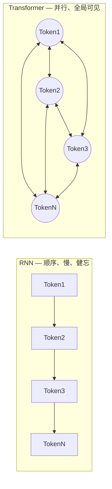

---

## 2. 文本 → 张量 (NB 02)

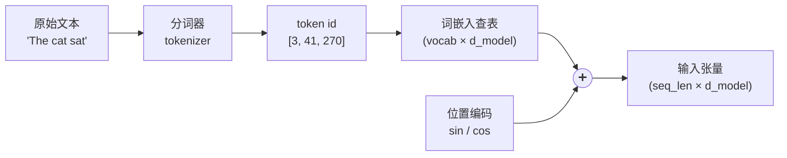

正弦位置编码的真实数值（每行一个位置，每列一个维度）：

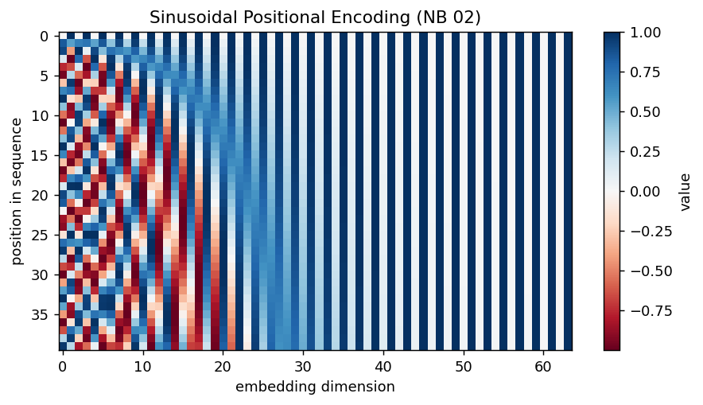

---

## 3. 自注意力的计算流程 (NB 03)

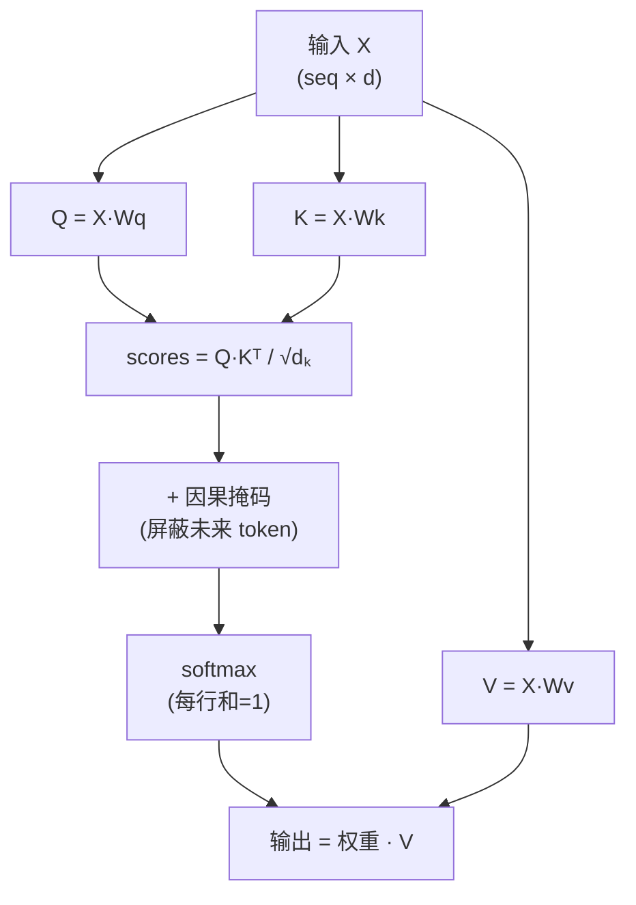

在一个玩具句子上算出的**真实**因果注意力权重——下三角，且每行归一化到 1：

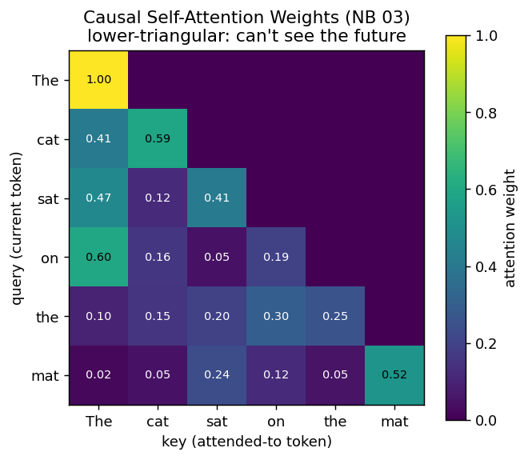

---

## 4. 多头注意力 (NB 04)

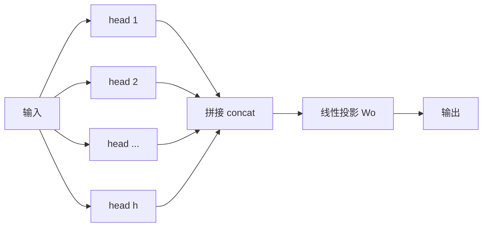

每个头在不同子空间里学不同的关系（语法、指代、位置…），拼接后再投影回 `d_model`。

---

## 5. Transformer Block (NB 05)

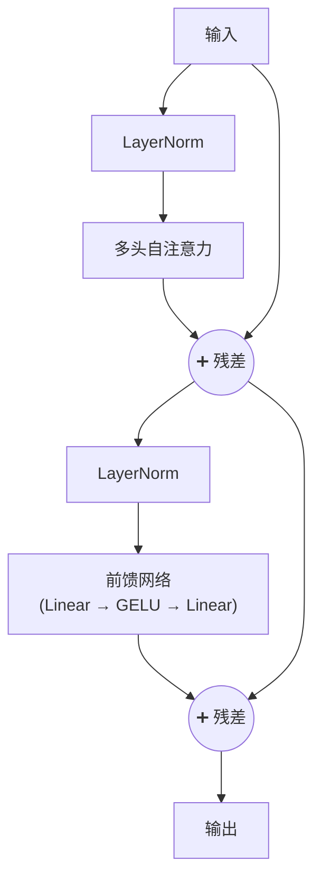

残差连接 + 归一化让深层网络可训练；这个 block 堆叠 N 次就是模型主体。

---

## 6. 完整 Decoder-only GPT (NB 06)

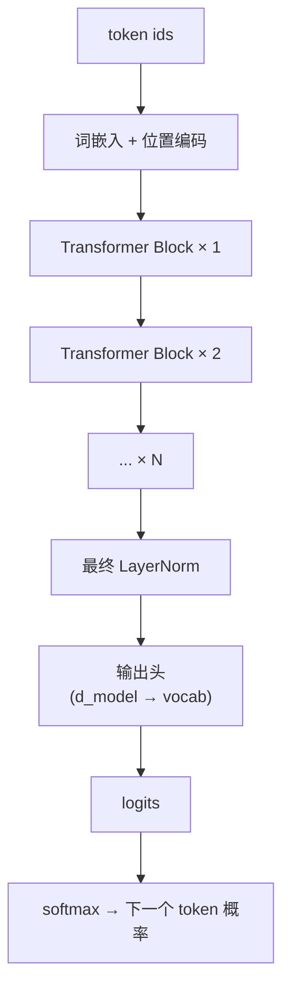

---

## 7. 训练流水线 (NB 07–08)

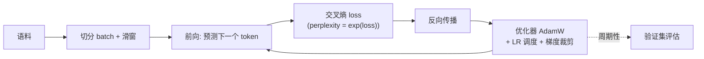

训练用的**学习率调度**（线性 warmup + 余弦衰减，精确公式）：

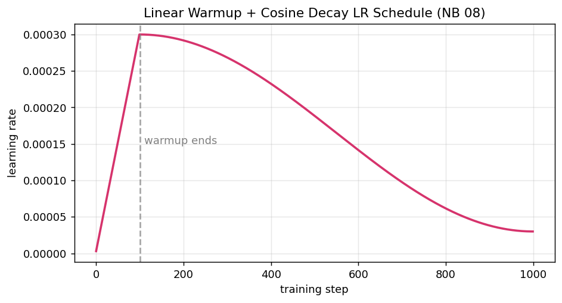

---

## 8. 推理与解码 (NB 09)

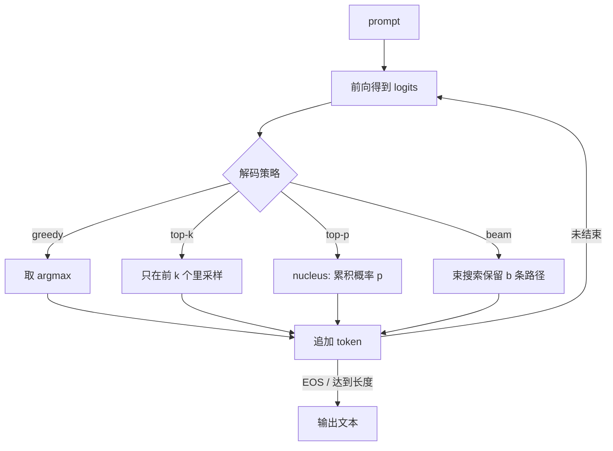

**KV cache**：自回归生成时缓存历史 token 的 K/V，每步只算新 token，避免重复计算。

---

## 9. 架构家族 (NB 10)

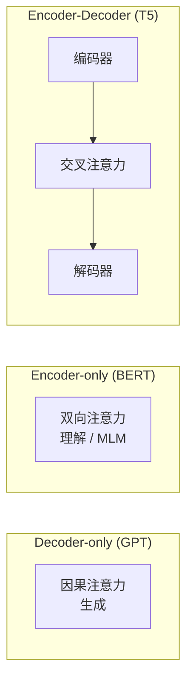

---

## 10. 现代 LLM 组件 (NB 11)

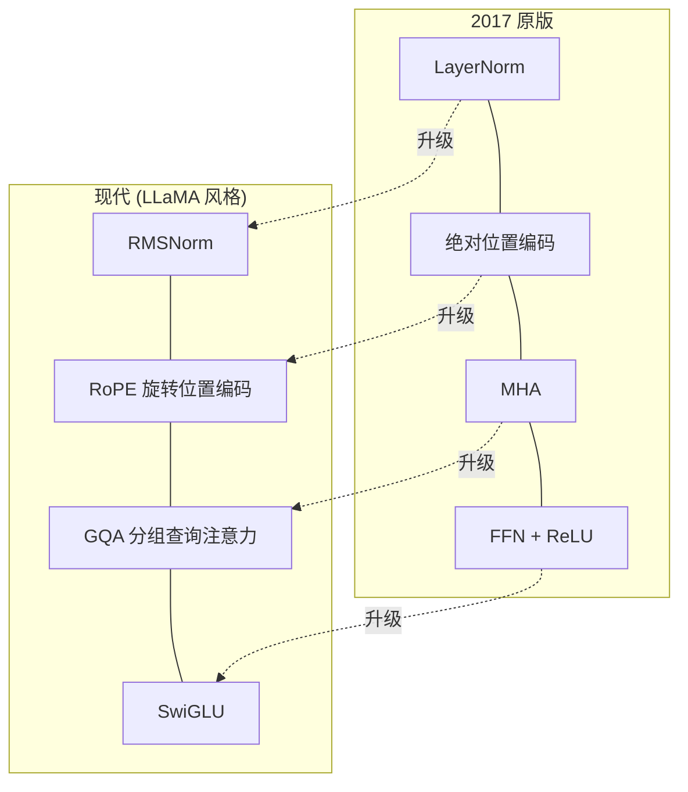

外加 **FlashAttention**：不改数学结果，只优化显存读写，让长序列训练更快更省。

---

## 11. 后训练：从 base 模型到对齐助手 (NB 12–13)

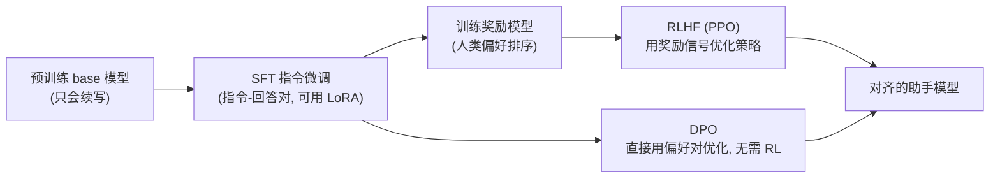

- **SFT**：教模型「按指令回答」，配合 **LoRA** 只训练少量低秩参数，省显存。
- **RLHF**：训练奖励模型 → 用 PPO 强化学习对齐人类偏好（InstructGPT 路线）。
- **DPO**：跳过奖励模型和 RL，直接用「优于/劣于」的偏好对做对比损失，更简单稳定。

---

> 想改图？Mermaid 直接编辑本文件即可；PNG 改 [`images/generate.py`](images/generate.py) 后重跑。
> 配套文字解释见各 notebook 与 [`study-guide.md`](study-guide.md)。
