# Diagrams & Pipelines

A visual companion to the notebooks. The **Mermaid** diagrams render automatically on GitHub; the
**PNG** figures (in [`images/`](images/)) are generated from real math by
[`images/generate.py`](images/generate.py) — re-run `python3 docs/images/generate.py` to rebuild
them.

> Flowcharts show *how data flows*; the PNGs show *what the real numbers look like*.

---

## 0. The whole journey

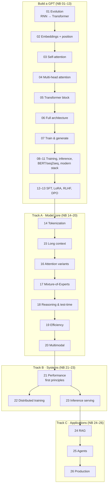
```mermaid
flowchart TD
    subgraph TRUNK["Build a GPT (NB 01–13)"]
        A[01 Evolution<br/>RNN → Transformer] --> B[02 Embeddings + position]
        B --> C[03 Self-attention]
        C --> D[04 Multi-head attention]
        D --> E[05 Transformer block]
        E --> F[06 Full architecture]
        F --> G[07 Train & generate]
        G --> H[08–11 Training, inference,<br/>BERT/seq2seq, modern stack]
        H --> I[12–13 SFT, LoRA, RLHF, DPO]
    end
    subgraph TA["Track A · Model core (NB 14–20)"]
        A1[14 Tokenization] --> A2[15 Long context]
        A2 --> A3[16 Attention variants]
        A3 --> A4[17 Mixture-of-Experts]
        A4 --> A5[18 Reasoning & test-time]
        A5 --> A6[19 Efficiency]
        A6 --> A7[20 Multimodal]
    end
    subgraph TB["Track B · Systems (NB 21–23)"]
        B1[21 Performance<br/>first principles] --> B2[22 Distributed training]
        B1 --> B3[23 Inference serving]
    end
    subgraph TC["Track C · Applications (NB 24–26)"]
        C1[24 RAG] --> C2[25 Agents]
        C2 --> C3[26 Production]
    end
    I --> A1
    A7 --> B1
    B3 --> C1
```

---

## 1. Why Transformers (NB 01)

RNNs process sequentially — hard to parallelize, and they forget across long distances. A
Transformer lets every token see every other token at once.

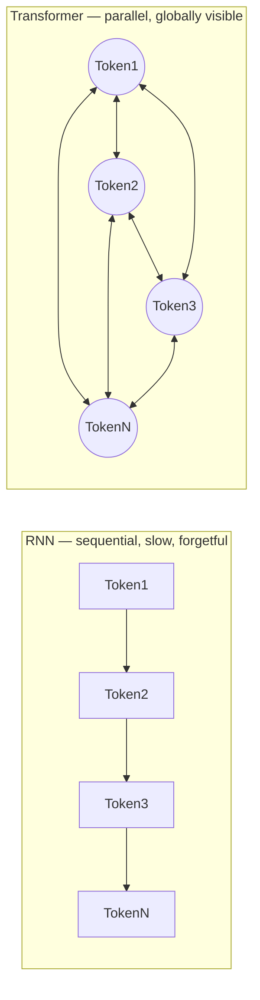
```mermaid
flowchart LR
    subgraph RNN["RNN — sequential, slow, forgetful"]
        t1[Token1] --> t2[Token2] --> t3[Token3] --> t4[TokenN]
    end
    subgraph TF["Transformer — parallel, globally visible"]
        s1((Token1)) <--> s2((Token2))
        s2 <--> s3((Token3))
        s1 <--> s3
        s1 <--> s4((TokenN))
        s2 <--> s4
        s3 <--> s4
    end
```

---

## 2. Text → tensor (NB 02, 14)

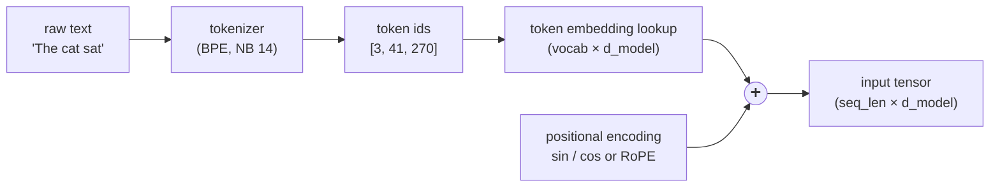
```mermaid
flowchart LR
    txt["raw text<br/>'The cat sat'"] --> tok["tokenizer<br/>(BPE, NB 14)"]
    tok --> ids["token ids<br/>[3, 41, 270]"]
    ids --> emb["token embedding lookup<br/>(vocab × d_model)"]
    emb --> add(("➕"))
    pos["positional encoding<br/>sin / cos or RoPE"] --> add
    add --> out["input tensor<br/>(seq_len × d_model)"]
```

The real values of sinusoidal positional encoding (one row per position, one column per dimension):

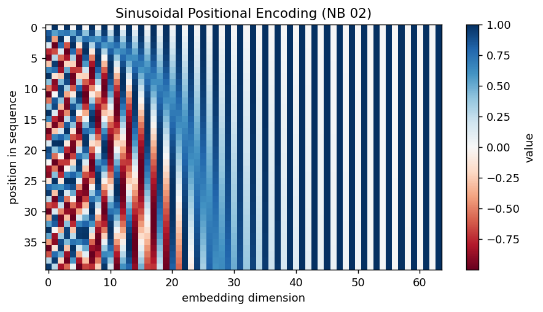

---

## 3. Self-attention (NB 03)

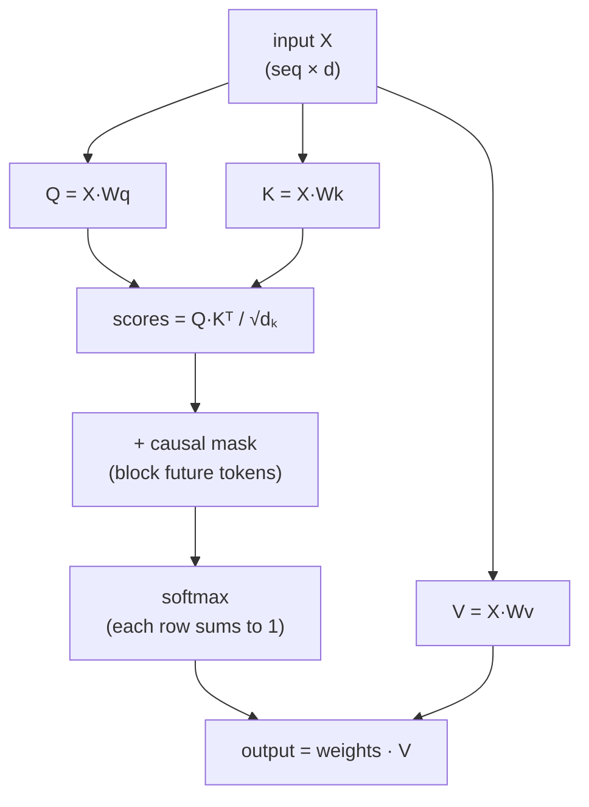
```mermaid
flowchart TD
    X["input X<br/>(seq × d)"] --> Q["Q = X·Wq"]
    X --> K["K = X·Wk"]
    X --> V["V = X·Wv"]
    Q --> S["scores = Q·Kᵀ / √dₖ"]
    K --> S
    S --> M["+ causal mask<br/>(block future tokens)"]
    M --> SM["softmax<br/>(each row sums to 1)"]
    SM --> O["output = weights · V"]
    V --> O
```

Real causal attention weights on a toy sentence — lower-triangular, each row normalized to 1:

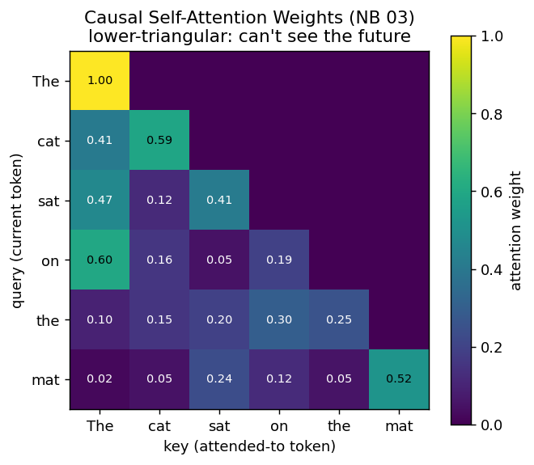

---

## 4. Multi-head attention (NB 04)

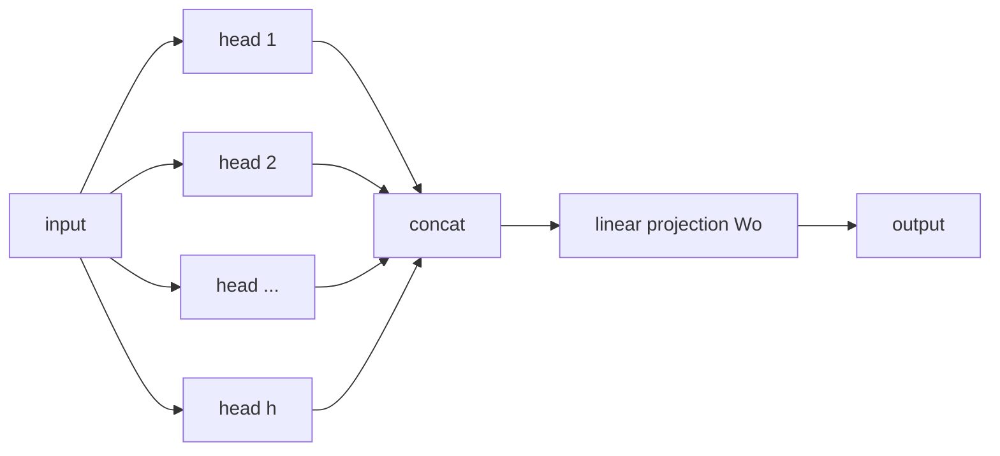
```mermaid
flowchart LR
    X[input] --> H1[head 1]
    X --> H2[head 2]
    X --> H3[head ...]
    X --> H4[head h]
    H1 --> C[concat]
    H2 --> C
    H3 --> C
    H4 --> C
    C --> P[linear projection Wo]
    P --> Y[output]
```

Each head learns different relationships (syntax, coreference, position) in its own subspace; the
results are concatenated and projected back to `d_model`.

---

## 5. Transformer block (NB 05)

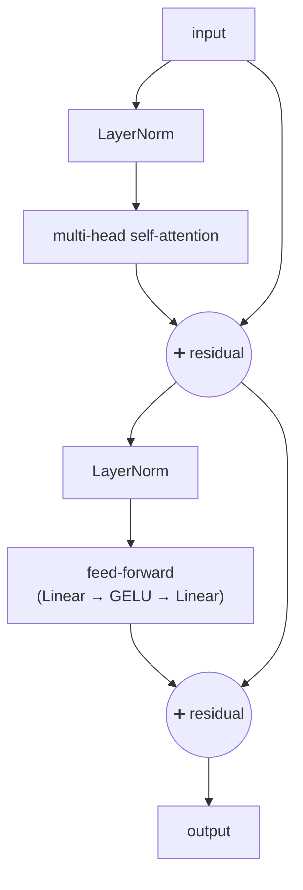
```mermaid
flowchart TD
    in[input] --> ln1[LayerNorm]
    ln1 --> mha[multi-head self-attention]
    mha --> r1(("➕ residual"))
    in --> r1
    r1 --> ln2[LayerNorm]
    ln2 --> ff["feed-forward<br/>(Linear → GELU → Linear)"]
    ff --> r2(("➕ residual"))
    r1 --> r2
    r2 --> out[output]
```

Residual connections plus normalization make deep networks trainable; stack this block N times to
form the model body.

---

## 6. Decoder-only GPT (NB 06)

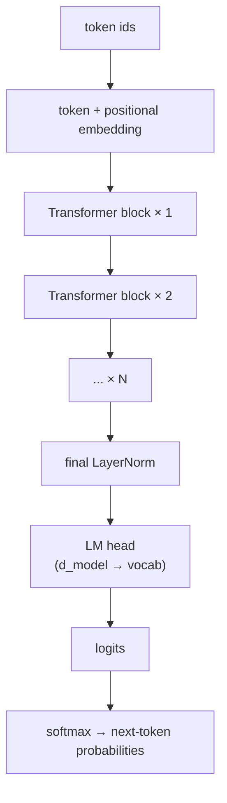
```mermaid
flowchart TD
    tok[token ids] --> emb[token + positional embedding]
    emb --> b1[Transformer block × 1]
    b1 --> b2[Transformer block × 2]
    b2 --> bn[... × N]
    bn --> lnf[final LayerNorm]
    lnf --> head["LM head<br/>(d_model → vocab)"]
    head --> logits[logits]
    logits --> sm["softmax → next-token probabilities"]
```

---

## 7. Training pipeline (NB 07–08)

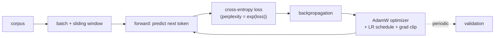
```mermaid
flowchart LR
    data[corpus] --> batch[batch + sliding window]
    batch --> fwd[forward: predict next token]
    fwd --> loss["cross-entropy loss<br/>(perplexity = exp(loss))"]
    loss --> bwd[backpropagation]
    bwd --> opt["AdamW optimizer<br/>+ LR schedule + grad clip"]
    opt --> fwd
    opt -. periodic .-> val[validation]
```

The training **learning-rate schedule** (linear warmup + cosine decay, exact formula):

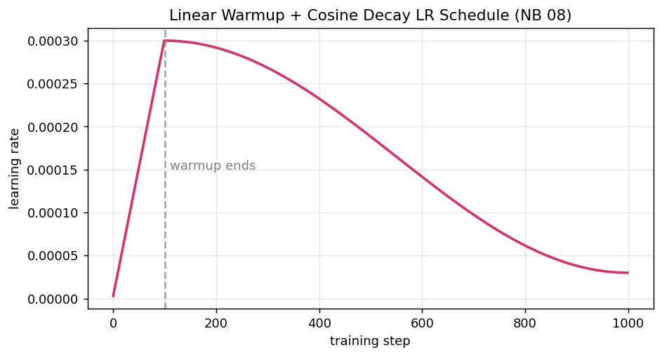

---

## 8. Inference & decoding (NB 09)

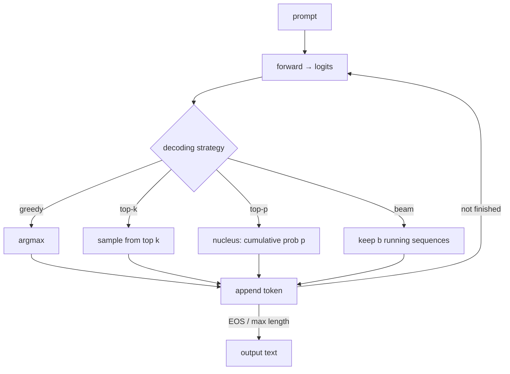
```mermaid
flowchart TD
    p[prompt] --> f[forward → logits]
    f --> dec{decoding strategy}
    dec -->|greedy| g[argmax]
    dec -->|top-k| tk[sample from top k]
    dec -->|top-p| tp[nucleus: cumulative prob p]
    dec -->|beam| bm[keep b running sequences]
    g --> nxt[append token]
    tk --> nxt
    tp --> nxt
    bm --> nxt
    nxt -->|not finished| f
    nxt -->|EOS / max length| done[output text]
```

**KV cache**: during autoregressive generation, cache the keys/values of past tokens so each step
computes only the new token, avoiding recomputation.

---

## 9. Architecture families (NB 10)

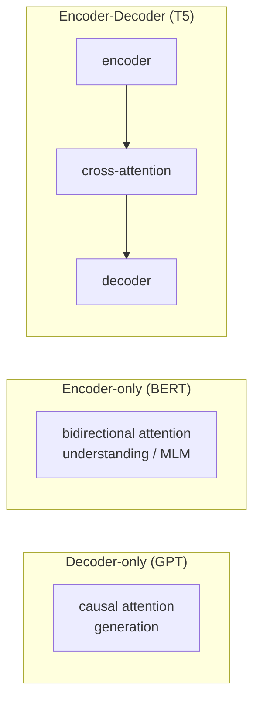
```mermaid
flowchart LR
    subgraph DEC["Decoder-only (GPT)"]
        d[causal attention<br/>generation]
    end
    subgraph ENC["Encoder-only (BERT)"]
        e[bidirectional attention<br/>understanding / MLM]
    end
    subgraph S2S["Encoder-Decoder (T5)"]
        en[encoder] --> cross[cross-attention] --> de[decoder]
    end
```

---

## 10. Modern LLM components (NB 11)

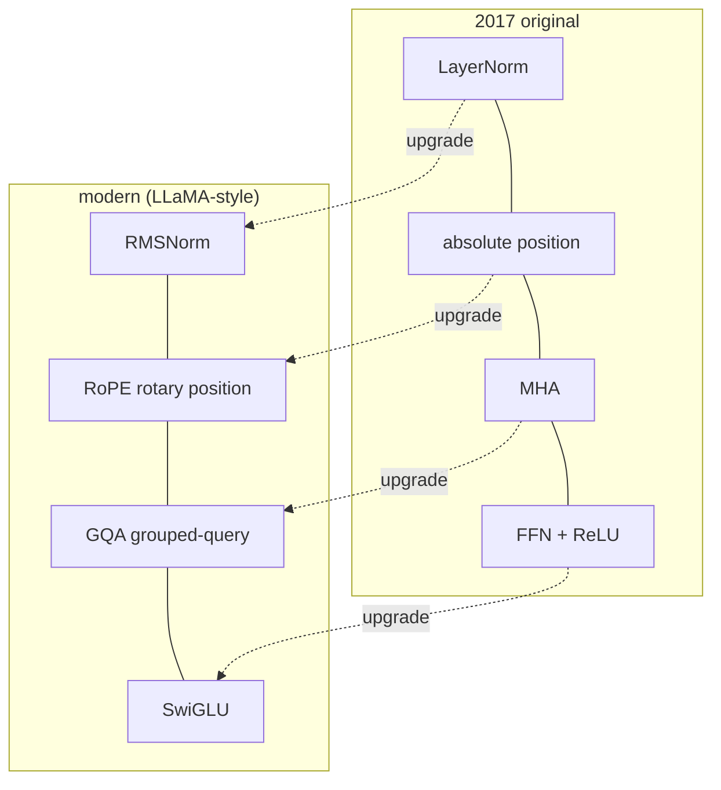
```mermaid
flowchart TD
    subgraph V2017["2017 original"]
        a1[LayerNorm] --- a2[absolute position] --- a3[MHA] --- a4[FFN + ReLU]
    end
    subgraph MODERN["modern (LLaMA-style)"]
        b1[RMSNorm] --- b2[RoPE rotary position] --- b3[GQA grouped-query] --- b4[SwiGLU]
    end
    a1 -.upgrade.-> b1
    a2 -.upgrade.-> b2
    a3 -.upgrade.-> b3
    a4 -.upgrade.-> b4
```

Plus **FlashAttention**: same mathematical result, IO-aware kernel — faster and more memory-frugal
on long sequences.

---

## 11. Post-training: base model → aligned assistant (NB 12–13)

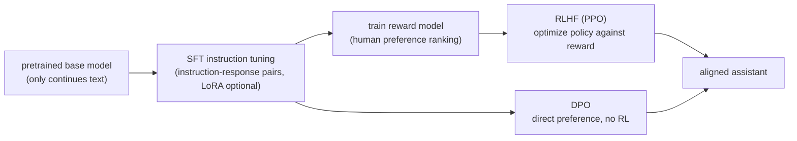
```mermaid
flowchart LR
    base["pretrained base model<br/>(only continues text)"] --> sft["SFT instruction tuning<br/>(instruction-response pairs, LoRA optional)"]
    sft --> rm["train reward model<br/>(human preference ranking)"]
    rm --> rlhf["RLHF (PPO)<br/>optimize policy against reward"]
    sft --> dpo["DPO<br/>direct preference, no RL"]
    rlhf --> aligned["aligned assistant"]
    dpo --> aligned
```

---

## 12. Tokenization: BPE training (NB 14)

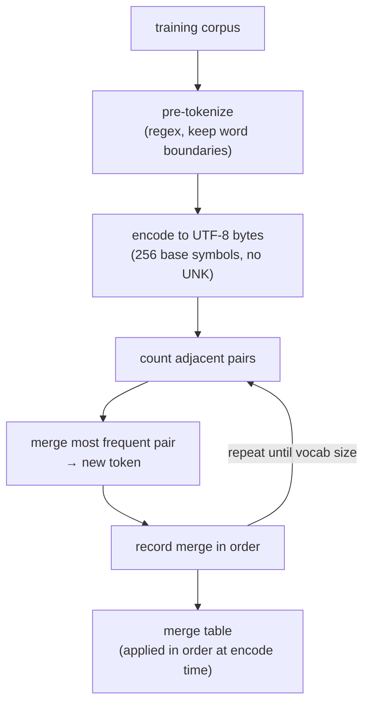
```mermaid
flowchart TD
    text[training corpus] --> pre["pre-tokenize<br/>(regex, keep word boundaries)"]
    pre --> bytes["encode to UTF-8 bytes<br/>(256 base symbols, no UNK)"]
    bytes --> count["count adjacent pairs"]
    count --> merge["merge most frequent pair<br/>→ new token"]
    merge --> record["record merge in order"]
    record -->|repeat until vocab size| count
    record --> done["merge table<br/>(applied in order at encode time)"]
```

---

## 13. Long context: RoPE scaling (NB 15)

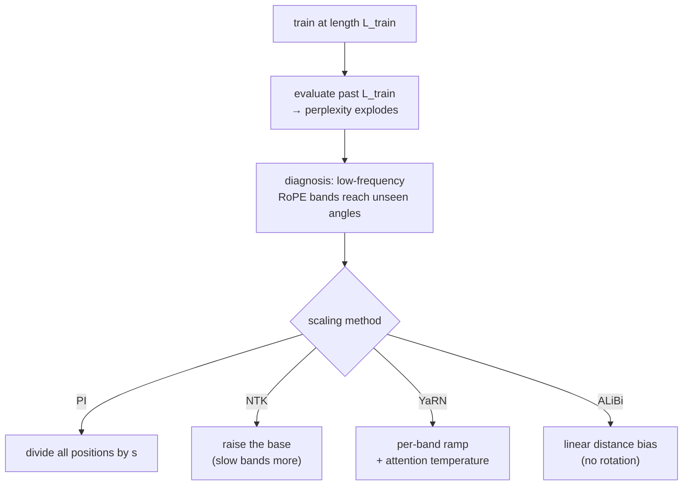
```mermaid
flowchart TD
    train["train at length L_train"] --> break["evaluate past L_train<br/>→ perplexity explodes"]
    break --> diag["diagnosis: low-frequency<br/>RoPE bands reach unseen angles"]
    diag --> fix{scaling method}
    fix -->|PI| pi["divide all positions by s"]
    fix -->|NTK| ntk["raise the base<br/>(slow bands more)"]
    fix -->|YaRN| yarn["per-band ramp<br/>+ attention temperature"]
    fix -->|ALiBi| alibi["linear distance bias<br/>(no rotation)"]
```

---

## 14. Attention variants: the state/recall trade-off (NB 16)

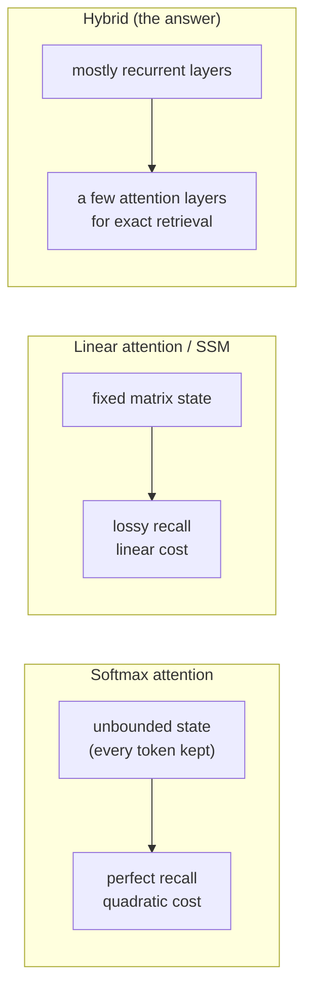
```mermaid
flowchart LR
    subgraph FULL["Softmax attention"]
        f1["unbounded state<br/>(every token kept)"] --> f2["perfect recall<br/>quadratic cost"]
    end
    subgraph LIN["Linear attention / SSM"]
        l1["fixed matrix state"] --> l2["lossy recall<br/>linear cost"]
    end
    subgraph HYB["Hybrid (the answer)"]
        h1["mostly recurrent layers"] --> h2["a few attention layers<br/>for exact retrieval"]
    end
```

---

## 15. Mixture-of-Experts routing (NB 17)

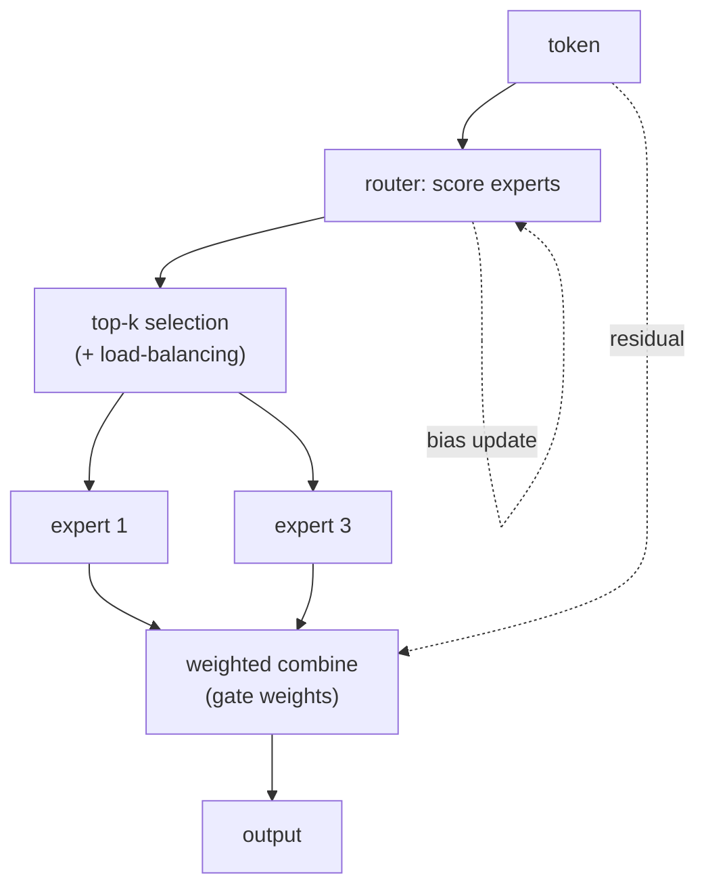
```mermaid
flowchart TD
    tok[token] --> router[router: score experts]
    router --> topk["top-k selection<br/>(+ load-balancing)"]
    topk --> e1[expert 1]
    topk --> e3[expert 3]
    e1 --> combine["weighted combine<br/>(gate weights)"]
    e3 --> combine
    tok -.->|residual| combine
    combine --> out[output]
    router -.->|bias update| router
```

---

## 16. Reasoning & test-time compute (NB 18)

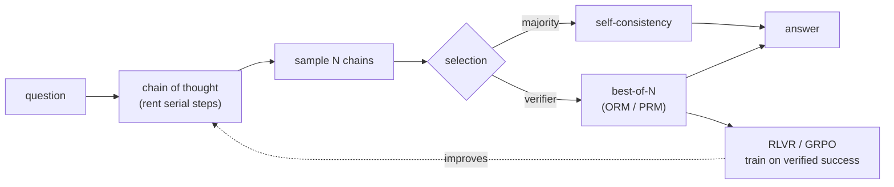
```mermaid
flowchart LR
    q[question] --> cot["chain of thought<br/>(rent serial steps)"]
    cot --> samples["sample N chains"]
    samples --> verify{selection}
    verify -->|majority| sc[self-consistency]
    verify -->|verifier| bon["best-of-N<br/>(ORM / PRM)"]
    bon --> rl["RLVR / GRPO<br/>train on verified success"]
    sc --> ans[answer]
    bon --> ans
    rl -.->|improves| cot
```

---

## 17. Performance first principles (NB 21)

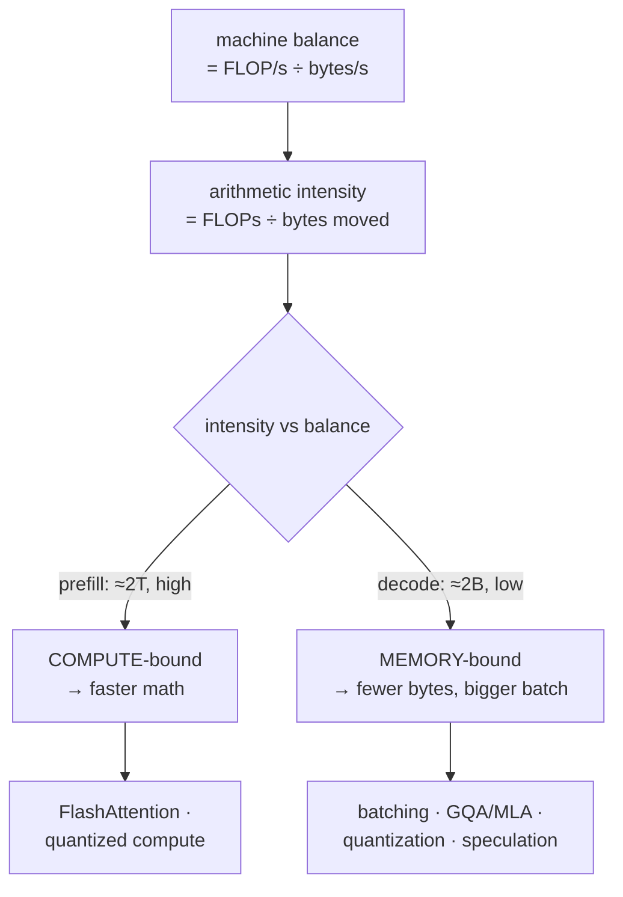
```mermaid
flowchart TD
    hw["machine balance<br/>= FLOP/s ÷ bytes/s"] --> ai["arithmetic intensity<br/>= FLOPs ÷ bytes moved"]
    ai --> cmp{intensity vs balance}
    cmp -->|prefill: ≈2T, high| pc["COMPUTE-bound<br/>→ faster math"]
    cmp -->|decode: ≈2B, low| mb["MEMORY-bound<br/>→ fewer bytes, bigger batch"]
    mb --> opt["batching · GQA/MLA ·<br/>quantization · speculation"]
    pc --> opt2["FlashAttention ·<br/>quantized compute"]
```

---

## 18. Distributed training (NB 22)

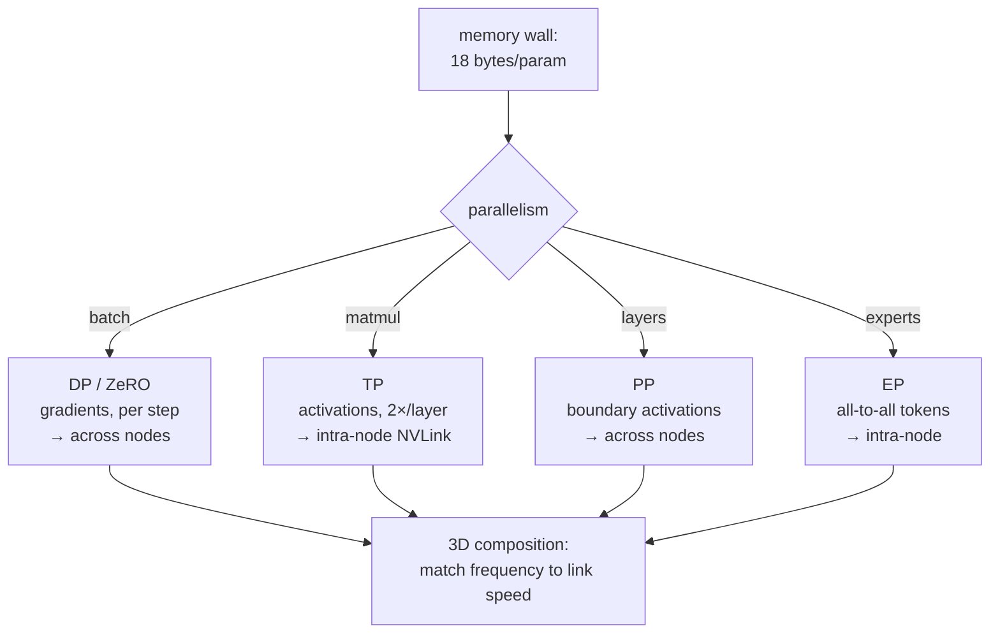
```mermaid
flowchart TD
    wall["memory wall:<br/>18 bytes/param"] --> split{parallelism}
    split -->|batch| dp["DP / ZeRO<br/>gradients, per step<br/>→ across nodes"]
    split -->|matmul| tp["TP<br/>activations, 2×/layer<br/>→ intra-node NVLink"]
    split -->|layers| pp["PP<br/>boundary activations<br/>→ across nodes"]
    split -->|experts| ep["EP<br/>all-to-all tokens<br/>→ intra-node"]
    dp --> combine["3D composition:<br/>match frequency to link speed"]
    tp --> combine
    pp --> combine
    ep --> combine
```

---

## 19. Inference serving (NB 23)

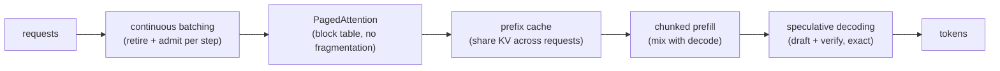
```mermaid
flowchart LR
    req[requests] --> cb["continuous batching<br/>(retire + admit per step)"]
    cb --> paged["PagedAttention<br/>(block table, no fragmentation)"]
    paged --> prefix["prefix cache<br/>(share KV across requests)"]
    prefix --> chunk["chunked prefill<br/>(mix with decode)"]
    chunk --> spec["speculative decoding<br/>(draft + verify, exact)"]
    spec --> out[tokens]
```

---

## 20. RAG pipeline (NB 24)

```mermaid
flowchart LR
    docs[documents] --> chunk[chunk<br/>sentence-aware]
    chunk --> embed[embed<br/>bi-encoder]
    embed --> index[(vector index)]
    q[query] --> retrieve{retrieve}
    index --> retrieve
    q --> bm25[BM25 sparse]
    retrieve --> fuse["RRF fusion<br/>(dense + sparse)"]
    bm25 --> fuse
    fuse --> rerank["rerank<br/>cross-encoder"]
    rerank --> assemble["assemble context<br/>(best first/last)"]
    assemble --> gen[generate + cite]
```

---

## 21. Agent loop (NB 25)

```mermaid
flowchart TD
    task[task] --> think["Thought<br/>(reason / plan)"]
    think --> decide{answer or act?}
    decide -->|act| action["Action<br/>(structured tool call)"]
    action --> harness["harness executes tool<br/>(NOT the model)"]
    harness --> obs["Observation<br/>(result → context)"]
    obs --> think
    decide -->|answer| done[final answer]
    harness -.->|guardrails,<br/>least privilege| action
```

---

## 22. Production system (NB 26)

```mermaid
flowchart TD
    req[request] --> guard1[input guardrails]
    guard1 --> route{router / cascade}
    route -->|easy| small[small model]
    route -->|hard| large[large model]
    small --> cache[caching layers]
    large --> cache
    cache --> serve["serving<br/>(paged KV, continuous batch)"]
    serve --> guard2[output guardrails]
    guard2 --> resp[response]
    resp -.->|trace| obs[observability]
    resp -.->|sample| eval["evaluation<br/>(offline + online)"]
```

---

> To edit a flowchart, change the Mermaid directly in this file. To change a PNG, edit
> [`images/generate.py`](images/generate.py) and re-run it. Prose explanations live in each
> notebook and in [`study-guide.md`](study-guide.md).
