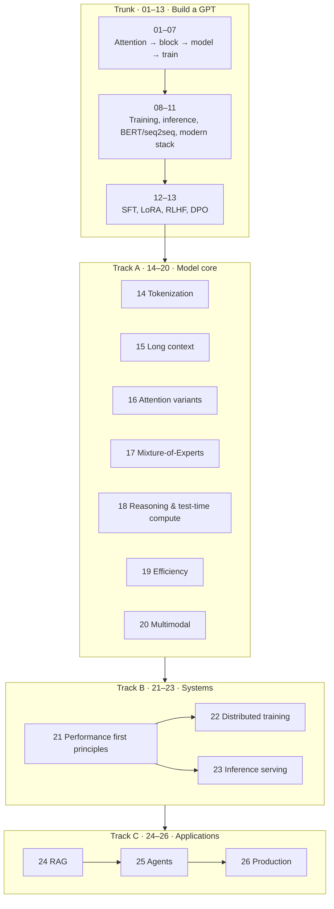

# Roadmap

The full arc of this repository, and how to navigate it depending on what you need.

The trunk (notebooks 01–13) builds a GPT from scratch and takes it through post-training
alignment. Three tracks extend it into a complete picture of how modern LLM *systems* are
built, served, and used.

---

## The whole picture



---

## What each track is for

| Track | Question it answers | Notebooks |
|---|---|---|
| **Trunk** | How does a Transformer work, and how does a base model become an assistant? | 01–13 |
| **A · Model core** | What is inside a *current* frontier model that the 2017 paper did not have? | 14–20 |
| **B · Systems** | How is such a model actually trained across thousands of GPUs and served to thousands of users? | 21–23 |
| **C · Applications** | How is it turned into a product — retrieval, agents, evaluation, safety? | 24–26 |

---

## Dependency graph

Most notebooks are readable alone, but some genuinely build on earlier results.

| Notebook | Requires | Why |
|---|---|---|
| 15 Long context | 11 (RoPE) | Every scaling method manipulates RoPE's frequency spectrum |
| 16 Attention variants | 11 (GQA), 09 (KV cache) | MLA is a KV-cache optimization; linear attention removes the cache |
| 17 Mixture-of-Experts | 05 (FFN) | MoE replaces the feed-forward network |
| 18 Reasoning | 13 (RLHF/PPO) | GRPO is explained by contrast with PPO |
| 19 Efficiency | 08 (training loop) | QAT needs the training loop; distillation needs a teacher |
| 20 Multimodal | 10 (encoders) | ViT *is* a BERT-style encoder with a different tokenizer |
| **21 Performance** | 09, 11 | The central result explains GQA, MLA, FlashAttention, and speculative decoding |
| 22 Distributed | **21** | Parallelism strategy follows from the memory and bandwidth accounting |
| 23 Serving | **21**, 09, 15 | PagedAttention, batching, and speculation all follow from prefill-vs-decode |
| 24 RAG | 20 (contrastive), 19 (quantization) | Embeddings are contrastively trained; ANN indexes are quantized |
| 25 Agents | 12, 18, 24 | Tool use is trained; agents use retrieval as memory |
| 26 Production | 12 (LoRA), 19, 23 | Multi-tenant serving, cost engineering, evaluation |

**Notebook 21 is the most load-bearing addition.** It derives that *prefill is compute-bound
and decode is memory-bandwidth-bound*, and that one result explains why GQA, MLA, quantization,
FlashAttention, speculative decoding, and continuous batching all exist. Read it before 22 or 23.

---

## Paths by role

### I want to understand how LLMs work
`01 → 07` → `08 → 11` → `12 → 13` → `14` → `16` → `18`

The trunk plus tokenization, the attention landscape, and reasoning. Skip the systems track.

### I train models
`08` → `11` → `14 → 20` (all of Track A) → `21 → 22`

Track A is your architecture toolkit; 21 and 22 are how it runs at scale. Notebook 17 (MoE) and
19 (efficiency) matter most for cost.

### I serve models / work on inference
`09` → `11` → `15` → `16` → `19` → **`21`** → `23` → `26`

Start with the KV cache, then the memory-bandwidth argument in 21, then the serving system in
23. Notebook 22 is optional.

### I build applications on top of models
`07` → `09` → `12 → 13` → `18` → `24 → 26`

You need decoding behaviour, what post-training did to the model, how reasoning modes work, and
then all of Track C.

### I need to make a buy/build/size decision
`21` (cost and memory accounting) → `19` (quantization trade-offs) → `23` (serving
architecture) → `26` (SLOs, routing, cost engineering)

---

## Time estimates

| Segment | Notebooks | Time |
|---|---|---|
| Trunk | 01–13 | ~9–10 h |
| Track A | 14–20 | ~7 h |
| Track B | 21–23 | ~4 h |
| Track C | 24–26 | ~4 h |
| **Total** | **01–26** | **~24 h** |

Notebooks in Tracks A–C each take 45–75 minutes to work through properly. Running the cells is
faster than that; the time is in reading the derivations and doing the self-checks.

---

## Running the code

Track A needs nothing beyond `requirements.txt` and runs on a CPU:

```bash
pip install -r requirements.txt
jupyter notebook notebooks/
```

Tracks B and C have some cells that use real libraries (`transformers`, `faiss`,
`sentence-transformers`). Those cells are clearly marked and **degrade gracefully** — without
the libraries installed they print an explanation and the expected result, so every notebook
reads end to end regardless. To run them:

```bash
pip install -r requirements-advanced.txt
```

`vllm`, `deepspeed`, and `flash-attn` are never dependencies. They appear as reading material —
quoted source and architecture diagrams — because they do not install on a CPU-only machine.

### Tests

```bash
pytest tests/
```

Covers the `src/` modules: tensor shapes, that the causal mask never leaks the future, that
RoPE is genuinely relative, that the KV cache is numerically identical to recomputation, that
LoRA merging is exact, and that MoE routing conserves probability mass.

---

## What lives in `src/`

The notebooks build things from scratch; `src/` holds the reusable versions.

| Module | Contents | Introduced in |
|---|---|---|
| `embeddings.py` | Token, sinusoidal, and learned positional embeddings | 02 |
| `attention.py` | Scaled dot-product, multi-head, causal (+ cached) attention | 03, 04, 09 |
| `transformer.py` | Feed-forward, blocks, encoder and decoder stacks | 05 |
| `gpt.py` | The 2017-style GPT, with KV-cache generation | 06, 09 |
| `train.py` | Character tokenizer, dataset, training loop | 07 |
| **`modern.py`** | RMSNorm, RoPE, SwiGLU, grouped-query attention, `ModernGPT` | 11 |
| **`moe.py`** | Router with both balancing schemes, `MoEFeedForward` | 17 |
| **`lora.py`** | `LoRALinear`, merging, multi-adapter serving | 12, 26 |

The two stacks are deliberately kept side by side. `gpt.py` is the original 2017 design;
`modern.py` is the LLaMA-era one. Comparing them is the point of notebook 11.

---

## Companion documents

| Document | Use it for |
|---|---|
| [study-guide.md](study-guide.md) | Objectives and self-check questions per notebook |
| [glossary.md](glossary.md) | One-line definitions of every term |
| [cheatsheet.md](cheatsheet.md) | Formulas, tensor shapes, and configuration tables |
| [architecture.md](architecture.md) | Systems reference: parallelism selection, serving decisions, cost formulas |
| [variants-atlas.md](variants-atlas.md) | Transformers beyond text — vision, speech, science, decision-making |
| [diagrams.md](diagrams.md) | Flowcharts for every stage |
| [references.md](references.md) | Primary sources by topic |
| [references-zh.md](references-zh.md) | 中文学习资料 |
